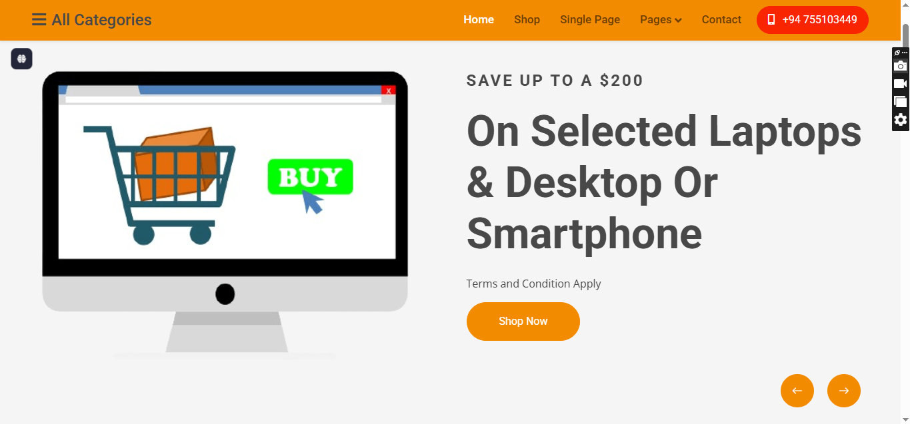

# 🛒 E-Commerce Website  

A modern and responsive **E-Commerce website** designed for online shopping.  
This project showcases product categories, single product pages, and a shopping cart system.  

---

## ✨ Features  

- 🏠 **Home Page** – Highlight offers and featured products  
- 🛍️ **Shop Section** – Browse multiple categories and items  
- 📄 **Single Product Page** – Detailed view of selected product  
- 📑 **Pages Section** – Additional pages like About, Services, etc.  
- 📞 **Contact Page** – Quick contact option for customers  
- 📱 **Responsive Design** – Works on desktop, tablet, and mobile  

---

## 🖼️ Preview  

  

---

## 🔗 Live Demo  

👉 [Click here to view the live demo](https://your-demo-link.com)  

---

## 🛠️ Technologies Used  

- **HTML5**  
- **CSS3**  
- **JavaScript**  
- **Responsive Design**  

---

## 🚀 How to Use  

1. Clone this repository:  
   ```bash
   git clone https://github.com/yourusername/ecommerce-website.git
